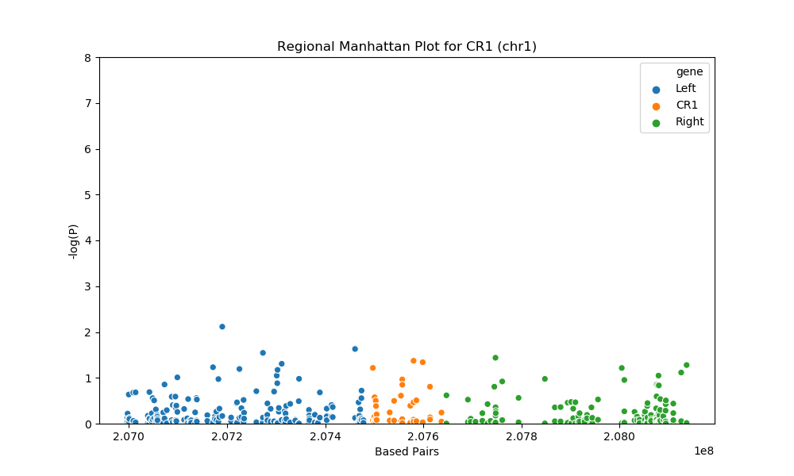
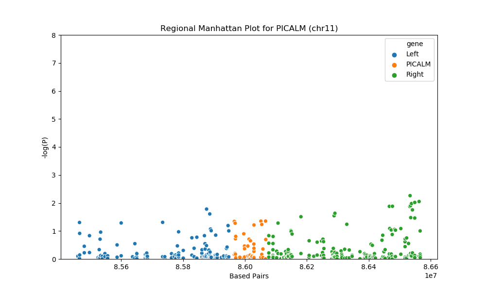
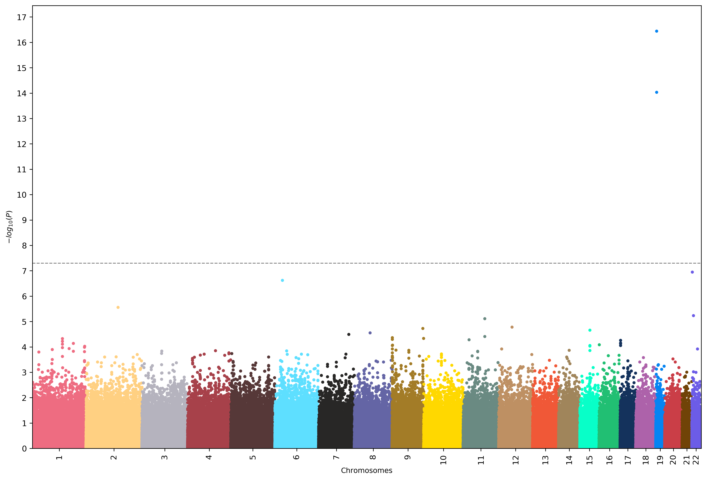
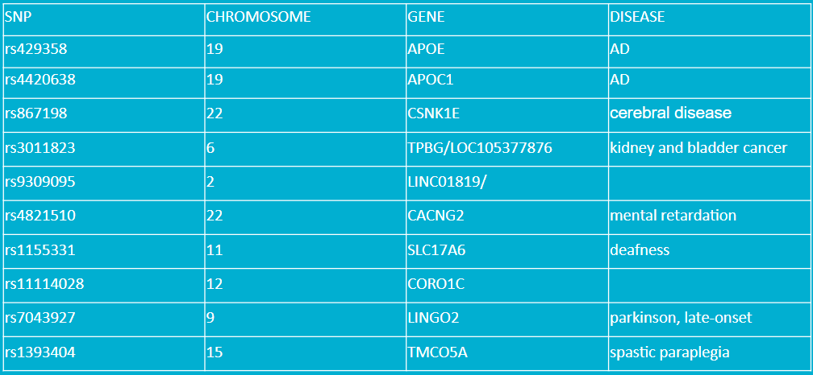
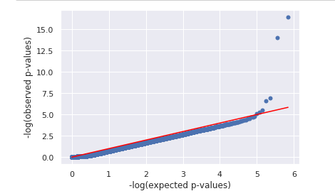
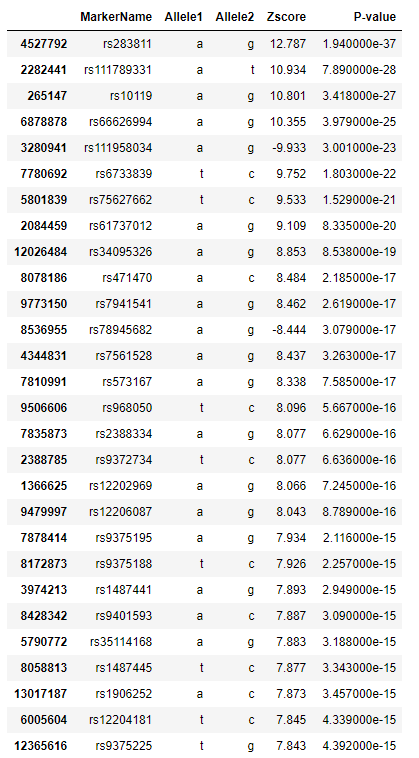
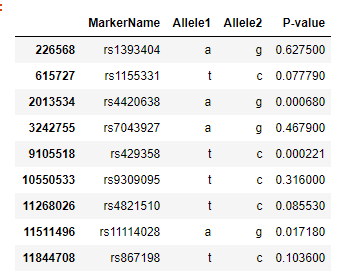

## GWAS on Alzheimer's Disease

---

### Background

A genome-wide association study (GWAS) is an approach commonly used in genetics research to associate specific genetic variations with particular diseases. The method involves scanning the genomes from many different people and looking for genetic markers that can be used to predict the presence of a disease [1].

Our GWAS focuses on Alzheimer’s disease (AD), a degenerative brain disease and the most common cause of dementia. Alzheimer's disease represents a major public health concern and has been identified as a research priority [2]. Patients suffer from memory loss, challenges in planning or solving problems, confusion with time or place, changes in mood and personality, increased anxiety, agitation and sleep disturbances. An estimated 5.4 million Americans have Alzheimer's disease. By the mid‐century, the number of people living with Alzheimer's disease in the United States is projected to grow to 13.8 million [3].

There are three common kinds of Alzheimer’s disease, early onset Alzheimer’s disease (EOAD), late-onset Alzheimer’s disease, and Familial Alzheimer’s disease. EOAD and LOAD are differentiated by if the patient is over 65 years older or not. We only look at cases of LOAD which takes up to more than 90% of all AD cases, so our study can potentially benefit the most people [4].

APOE is widely accepted as a major genetic risk determinant of LOAD and therefore is not included as one of the risk genes to be studied by many studies anymore [5]. In "Genome-wide association study of Alzheimer's disease", a paper published in 2012, the researchers examined implicated nine new regions with LOAD risk, and also performed a meta-analysis along with four independent data sets to identify new AD loci. Nominal significant associations (P < 0.05) were observed either within or adjacent to five genes (PICALM, BIN1, ABCA7, MS4A4/MS4A6E and EPHA1), significant signals were observed 69–180 kb outside of the remaining four genes (CD33, CLU, CD2AP and CR1). Meta-analysis revealed a suggestive novel association in the PPP1R3B gene [6]. 

---

### Overview

Inspired by the previous studies,we hoped to replicate the association analysis of these nine regions (CR1, BIN1, CLU, PICALM, MS4A4/MS4A6E, CD2AP, CD33, EPHA1 and ABCA7) on another data set to see if the results remain consistent across different subjects. Also, we tried to detect other potential genes other than those nine and APOE through meta analysis. We came to our conclusion by interpreting the results of association analysis and meta analysis in manhattan plot, regional plots, qq-plot and meta-analysis table.

---

### Dataset

Our primary data set comes from Dr. Amanda J. Myers at University of Miami School of Medicine. The data set includes 364 subjects (191 males and 173 females, 176 are cases and 188 are controls). We have Genotypes calls from 502,627 SNPs on the 364 samples.

The control cohort and case cohort were obtained from 20 National Alzheimer's Coordinating Center (NACC) brain banks and from the Miami Brain Bank. The criteria for inclusion were as follows: self-defined ethnicity of European descent, neuropathologically confirmed LOAD or no neuropathology present, and age of death greater than 65. We restricted samples to only of European ethnicity because allele-frequency differences between groups with different ethnicity might create bias in the results [7]. 

For meta-analysis, we found three additional datasets. The first one includes 3,444 controls and 653 controls[8]; The second one includes 27,696 cases of maternal AD (260,980 controls) and 14,338 cases of paternal AD (245,941 controls) [9]; The third one contains 17,008 Alzheimer's disease cases and 37,154 controls [10].

---

### Analysis Results

#### Regional Manhattan Plots

For the regional plots, we have the base pairs on the X-axis, which represent the location on each chromosome and negative log of P-value on the Y-axis. The higher the y value is, the more likely that the SNP is associated with LOAD. Any SNP with P < 0.05 will be considered as significant. We use orange to represent the SNPs on the gene and blue and green to represent the neighbors.

For gene CR1 at chromosome 1, there are total of 2 SNPs with p<0.05, the 2 significant SNPs are: rs7514606 (P = 0.04243) and rs6540648 (P = 0.04565)

For gene PICALM at chromosome 11, there are total of 3 sips with p<0.05, the 3 significant SNPs are: rs7935611 (P = 0.04535), rs10898524 (P = 0.04447), and rs1938936 (P = 0.04430)

#### Manhattan Plot

Manhattan plot shows the negative log of P-value on the Y-axis and  chromosome  number  on  the  X-axis. This  plot  shows  the  association  of Alzheimer’s Disease to each one of the 22 chromosomes,  the higher the value on the y-axis the more correlated that chromosome is with Alzheimer’s Disease. In our result, we see a sharp rise in p-value at position chromosome 19, this tells us chromosome 19 contains genes that are highly correlated with Alzheimer’s Disease.

This table shows the top 10 SNPs from our result. The table shows the SNPs and their chromosome location, related gene, and related disease. APOE and APOC1 genes are known to be related to AD.Other important ones to notice are: CSNK1E, CACNG2, SLC17A6, LINGO2, since they all are somewhat related to neuro diseases. 

#### QQ-plot

QQ plot stands for quantile-quantile plot, QQ plot is done by plotting log of observed p-value (y-axis) against the log of expected p-value (x-axis) [11]. If all the dots remain a straight line it means that the observed p-value follows a uniform distribution and there is no causal polymorphism. If there is a tail at the end of the plot it means that there are extreme p-values in the data, meaning there is causal polymorphism.

In our qq plot we see that there is a tail, which means there is causal polymorphism in our data that produced significant SNP p-value. 

---

### Meta-analysis

Meta analysis is the statistical analysis of combining multiple scientific studies together [12]. We incorporated three other data sets then produced the result. We can see that all of our significant SNPs we found are not in the top meta analysis result. Meaning that our result does not stand up to other dataset. 

We then looked up our significant SNPs in the meta analysis result and found their p-values shown in the table. We see that out of our ten significant SNPs, only two of them (rs4420638, corresponds to APOC1 gene) and (rs429358, corresponds to APOE gene) appear to be significant.

---

### Reference

1. https://www.genome.gov/genetics-glossary/Genome-Wide-Association-Studies
2. https://doi.org/10.1016/S0140-6736(10)61349-9
3. https://doi.org/10.1016/j.jalz.2016.03.001
4. https://www.webmd.com/alzheimers/guide/alzheimers-types
5. https://www.nature.com/articles/s41582-019-0228-7
6. https://www.ncbi.nlm.nih.gov/pmc/articles/PMC3365264/
7. https://www.cell.com/ajhg/fulltext/S0002-9297(09)00108-6
8. https://www.niagads.org/datasets/ng00073
9. https://www.nature.com/articles/s41398-018-0150-6
10. http://web.pasteur-lille.fr/en/recherche/u744/igap/igap_download.php
11. https://physiology.med.cornell.edu/people/banfelder/qbio/resources_2013/2013_1_Mezey.pdf
12. https://www.ncbi.nlm.nih.gov/pmc/articles/PMC3049418/

